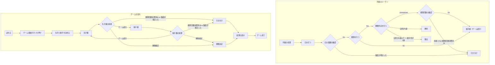

# 01.Screen State Transition

# ゲームプレイ画面

## ゲーム仕様についての補足
### 観測時の勝敗条件について
このゲームでは1回の観測で、両者同時に勝利条件を満たすことがある。
その場合、この仕様では観測者が有利になるように、観測者勝利としている。  
本家量子五目並べ（QuizKnock）でも、両者が同時に勝利条件を満たした時は観測者勝利となっている。
### 観測回数を消費した時
観測回数を消費したときは引き分け扱いにしている。  
引き分けにならないようにする実装としては、両者が観測回数を全て消費した時に両者に観測を配布することが考えられる。
### 盤面が埋まった時
現状盤面サイズは決まっていないが、最終的に石を打ち尽くして盤面が埋まる可能性がある。  
このとき、この仕様では引き分け扱いとしている。
本家五目並べ（連珠）でも引き分けとなっている。
将来的には観測が余っている場合の実装として  
・1度だけ観測を行い、決着がつかなかった場合は引き分けにする  
・残っている観測を次手番の人の分から消費する  
・残りの観測回数に関係なく次手番の人から交互に観測を行う  
・（元々先手が不利になると思うので）観測者を先手と考えて決着がつくまで観測を行う  
などが考えられる。可能性は低いが、複数回観測を行っても決着がつかなかった時の実装まで考える必要がある。
### ルールについて
・先手後手の有利不利  
本家五目並べでは、先手（黒）に禁じ手が存在する。量子五目並べでも最初に使用できる石を制限するなどの実装が考えられる。
### その他
ユーザー毎に勝敗数などを記録するのであれば、引き分けの有無で記録の基準が変わるので、勝敗に関して実装を変える際は慎重な検討が必要になる。