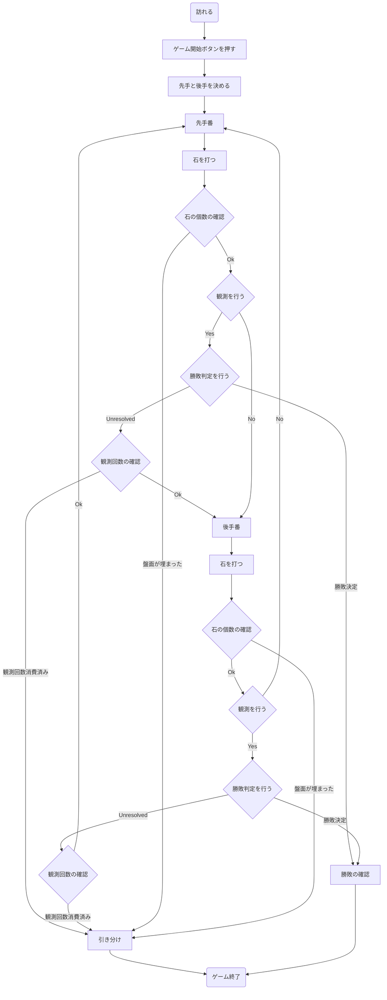

# 01.Screen State Transition

## ゲームプレイ画面

```mermaid
graph TD;
    A("訪れる")-->B["ゲーム開始ボタンを押す"]
    B-->C["先手と後手を決める"]
    C-->SENTE
    SENTE["先手番"]
    GOTE["後手番"]

    SENTE-->S_stone["石を打つ"]
    S_stone-->S_stone_cnt{"石の個数の確認"}
    S_stone_cnt-->|Ok| S_obs{"観測を行う"}
    S_obs-->|Yes| S_check{"勝敗判定を行う"}
    S_check-->|Unresolved| S_obs_cnt{"観測回数の確認"}
    S_obs_cnt-->|Ok| GOTE
    S_obs-->|No| GOTE

    GOTE-->G_stone["石を打つ"]
    G_stone-->G_stone_cnt{"石の個数の確認"}
    G_stone_cnt-->|Ok| G_obs{"観測を行う"}
    G_obs-->|Yes| G_check{"勝敗判定を行う"}
    G_obs-->|No| SENTE
    G_check-->|Unresolved| G_obs_cnt{"観測回数の確認"}
    G_obs_cnt-->|Ok| SENTE

    S_obs_cnt & G_obs_cnt-->|観測回数消費済み| Draw["引き分け"]
    S_stone_cnt & G_stone_cnt-->|盤面が埋まった| Draw
    S_check & G_check-->|勝敗決定| Fin["勝敗の確認"]
    Draw-->End
    Fin-->End("ゲーム終了")
```