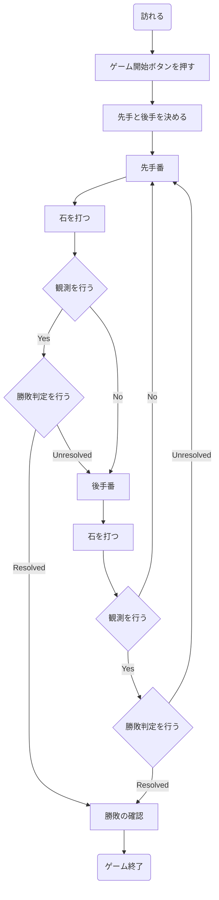

# 01.UserExperience

```mermaid
graph TD;
    AA("訪れる")-->BB["ゲーム開始ボタンを押す"]
    BB-->CC["先手と後手を決める"]
    CC-->SENTE
    SENTE["先手番"]
    GOTE["後手番"]
    SENTE-->S_stone["石を打つ"]
    S_stone-->S_obs{"観測を行う"}
    S_obs-->|Yes| S_check{"勝敗判定を行う"}
    S_check-->|Resolved| FinFin["勝敗の確認"]
    S_check-->|Unresolved| GOTE
    S_obs-->|No| GOTE

    GOTE-->G_stone["石を打つ"]
    G_stone-->G_obs{"観測を行う"}
    G_obs-->|Yes| G_check{"勝敗判定を行う"}
    G_obs-->|No| SENTE
    G_check-->|Resolved| FinFin["勝敗の確認"]
    G_check-->|Unresolved| SENTE

    FinFin-->EndEnd("ゲーム終了")

```